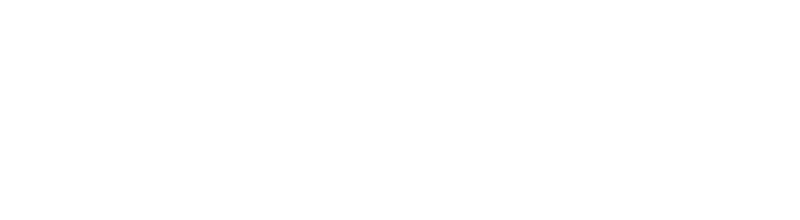

<!-- Fancy Header :) -->

  

  
    Skinny R&D 3D Prints 
    
      A collection of community designs and challenges!
    
  

<!-- End of Header -->

## Challenges

If you want to hone or refresh your CAD skills, this is a great place to be. We'll try to post a challenge once a month for you to tackle. There will also be a solution included if you want to take a look when you're done.

## Designs

The designs folder is a collection of mesh files and descriptions made by the community. Each project is organised by the device it was made for. Every design has the mesh, a brief README, and at least one picture of the design.

### Contributing

Made an awesome or useful design and want to share the love? We want you to do just that! Feel free to throw up a pull request with a new folder that has your design. To make it easy on us, take a look at any of the designs currently posted and copy that format.

## Want Training and a Printer?

Of course you do! We'll get you set up with both! Reach out to us at <contact@skinnyrd.com> for a quote or visit our [website](https://skinnyrd.com/training/3d-printing-for-technical-operations/) for more information.

<!-- Company Logo -->

  

<!-- End of Logo -->
